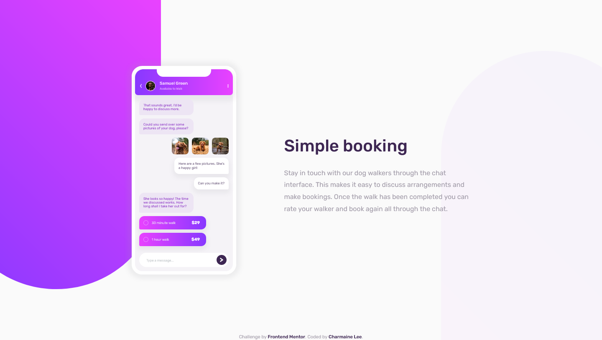

# Frontend Mentor - Chat app CSS illustration solution

This is a solution to the [Chat app CSS illustration challenge on Frontend Mentor](https://www.frontendmentor.io/challenges/chat-app-css-illustration-O5auMkFqY). Frontend Mentor challenges help you improve your coding skills by building realistic projects.

## Table of contents

- [Overview](#overview)
  - [The challenge](#the-challenge)
  - [Screenshot](#screenshot)
  - [Links](#links)
- [My process](#my-process)
  - [Built with](#built-with)
  - [What I learned](#what-i-learned)
  - [Continued development](#continued-development)
  - [Useful resources](#useful-resources)
- [Author](#author)
- [Acknowledgments](#acknowledgments)

## Overview

### The challenge

Users should be able to:

- View the optimal layout for the component depending on their device's screen size
- **Bonus**: See the chat interface animate on the initial load

### Screenshot

### Links

- Solution URL: [Click here!](https://github.com/charmainelhm/frontend-mentor-chat-app-css-illustration)
- Live Site URL: [Click here!](https://infallible-noyce-41aa95.netlify.app/)

## My process

### Built with

- Semantic HTML5 markup
- CSS custom properties
- Flexbox
- Mobile-first workflow

### What I learned

- Used calc() to perform calculatioon for CSS property values
- Used absolute positioning to determine the height of the background shapes
- Used transform property to rotate background shape

### Continued development

- Further readup on positioning and positioning
- Explore other ways of using the transform propety in CSS properties
- Animation of the different elements

### Useful resources

- [Setting Width and Height for Full Page Size](https://www.freecodecamp.org/news/html-page-width-height/) - A good explanation of how percentage works and how the parent elements affect their child elements.

## Author

- LinkedIn - [Charmaine Lee](https://www.linkedin.com/in/charmainelee-huimin/)
- Frontend Mentor - [@charmainelhm](https://www.frontendmentor.io/profile/charmainelhm)
- Twitter - [@noodercob_ie](https://www.twitter.com/noodercob_ie)

## Acknowledgments

Practice is a very important learning stage in coding, and I want to thank [Frontend Mentor](https://www.frontendmentor.io/) for making it easier for me to do that. With their help, I can focus on understanding the different properties in HTML and CSS with my minimal knowledge on UI and UX design.
